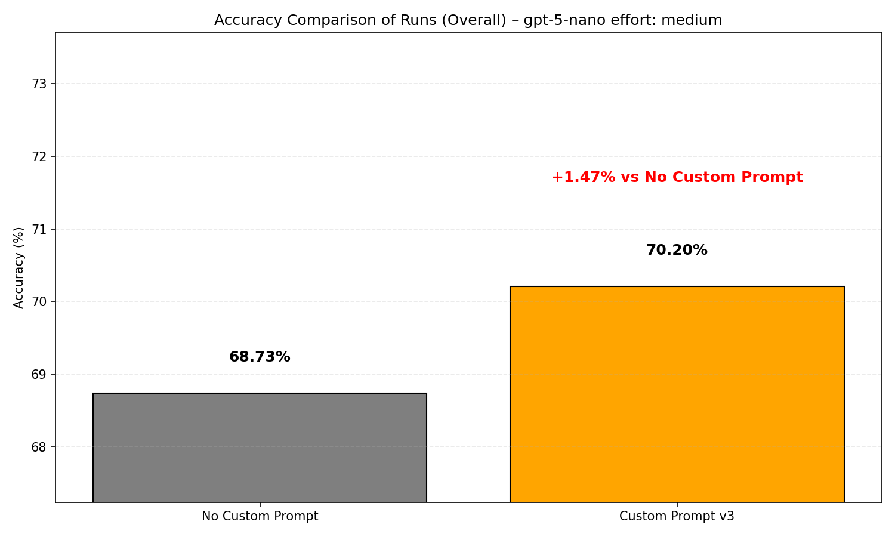
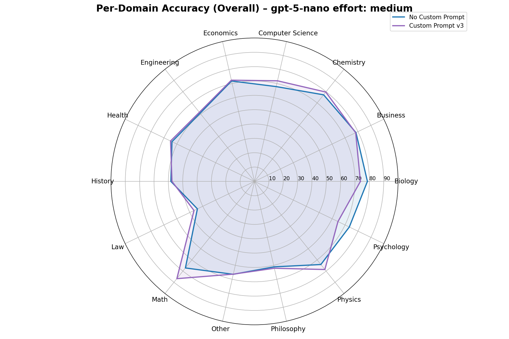

# ChatGPT Custom Instructions
Optimized custom instructions for **ChatGPT** and **Operator** that improve performance.

Original version: https://github.com/DenisSergeevitch/chatgpt-custom-instructions

## How to Apply
1. Go to ChatGPT
2. Navigate to Settings
3. Select Personalization
4. Enter the instructions from the file `instructions.md` in “What traits should ChatGPT have?” section

## Results on MMLU PRO

| Domain | Correct | Wrong | Total | Accuracy |
|---|---:|---:|---:|---:|
| Biology | 529 | 188 | 717 | 73.78% |
| Business | 617 | 172 | 789 | 78.20% |
| Chemistry | 902 | 230 | 1132 | 79.68% |
| Computer Science | 295 | 115 | 410 | 71.95% |
| Economics | 611 | 233 | 844 | 72.39% |
| Engineering | 597 | 372 | 969 | 61.61% |
| Health | 531 | 287 | 818 | 64.91% |
| History | 219 | 162 | 381 | 57.48% |
| Law | 515 | 586 | 1101 | 46.78% |
| Math | 1172 | 179 | 1351 | 86.75% |
| Other | 613 | 311 | 924 | 66.34% |
| Philosophy | 310 | 189 | 499 | 62.12% |
| Physics | 1021 | 278 | 1299 | 78.60% |
| Psychology | 515 | 283 | 798 | 64.54% |

| Overall | Correct | Wrong | Total | Accuracy |
|---|---:|---:|---:|---:|
| All Domains | 8447 | 3585 | 12032 | 70.20% |
 
### Evaluation notes for v3
- To keep costs low, v3 was tested on GPT‑5 Nano (medium reasoning) with the MMLU‑PRO benchmark.
- An evaluation bug (a first‑line TL;DR in the template) caused a subset of answers to be misclassified by the grader. Even with this caveat, the v3 prompt outperformed the baseline. I’ll rerun and update once re‑tested.

## Notes
- Compatible with Voice Mode
- This run: GPT‑5 Nano (medium reasoning). Also works with GPT‑5 and GPT‑5 Thinking/Pro.

## References
- Prompting guides: [MagicPath GPT‑5 guide](https://designs.magicpath.ai/v1/sturdy-valley-4825), [OpenAI GPT‑5 Prompting Guide](https://cookbook.openai.com/examples/gpt-5/gpt-5_prompting_guide)

# Operator Custom Instructions
First version addressing basic interaction issues with Operator.

## How to Apply
1. Go to [Operator](https://operator.chatgpt.com/)
2. Navigate to Settings
3. In General, copy the content of `operator-instructions.md` to `Custom Instructions`

# License
Feel free to use and modify these instructions for your own use.
